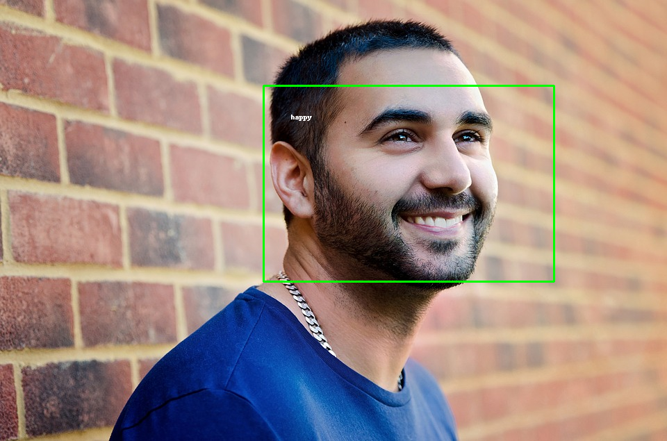

## Introduction
In this project, convolutional neural network is used to build the whole system, and model evaluation is carried out on two facial expression recognition datasets(Jaffe and CK+).


## Data preparation
We use Jaffe and CK+ as the dataset.
 - Jaffe
   - Michael J. Lyons, Shigeru Akemastu, Miyuki Kamachi, Jiro Gyoba. Coding Facial Expressions with Gabor Wavelets, 3rd IEEE International Conference on Automatic Face and Gesture Recognition, pp. 200-205 (1998).
 - CK+
   - Lucey P, Cohn J F, Kanade T, et al. The extended cohn-kanade dataset (ck+): A complete dataset for action unit and emotion-specified expression[C]//2010 IEEE Computer Society Conference on Computer Vision and Pattern Recognition-Workshops. IEEE, 2010: 94-101.


## Methodology
### **Traditional method**
- Data pre-process
	- Image smoothness
	- Face detection (HAAR classifier in opencv)
- Feature engineering
	- Extract facial feature
		- LBP
		- Gabor
- Classifier
	- SVM
### **Deep learning method**(used in this project)
- Face detection
	- HAAR classifier
- CNN
  - For feature extraction + classification


## Network design
Using the classic convolutional neural network, the construction of the model mainly refers to a CVPR paper in 2018: A Compact Deep Learning Model for Robust Facial Expression Recognition to design the following network structure. After the input layer, a (1,1) convolutional layer is added to increase the nonlinear representation and the model level is shallow. , with fewer parameters (a large number of parameters are concentrated in the fully connected layer).
<div align="center"></div>
<div align="center"></div>


## Model training
The CNN model is mainly trained on JAFFE and CK+. JAFFE gives a half-length image, so face detection has to be done. The 5-fold cross-validation reached an accuracy rate of about 99%.

Use the command below to train the specified epochs on the dataset (jaffe or ck+）using a specific batch_size. The training will generate the corresponding visual training process. Here is an example of plotting the training process after the model has been trained on jaffe.

```shell
python src/train.py --dataset jaffe --epochs 150 --batch_size 16 
```


```shell
python src/train.py --dataset ck+ --epochs 150 --batch_size 32 
```


## Application 
Compared with traditional methods, convolutional neural network performs better. So we use this model to build recognition system, and provide **GUI interface** to realize interaction.When predicting, a picture is horizontally flipped, deflected by 15 degrees, and translated to obtain multiple probability distributions, and these probability distributions are weighted and summed to obtain the final probability distribution. At this time, the label with the highest probability is used as the label (i.e. using inference data augmentation).

### **Graphical User Interface**

Execute the following command to open the GUI program, which relies on PyQT, and the test effect on a test picture is as shown in the figure below.

```shell
python src/gui.py
```


Meanwhile, the result will be output to the "output" folder.


